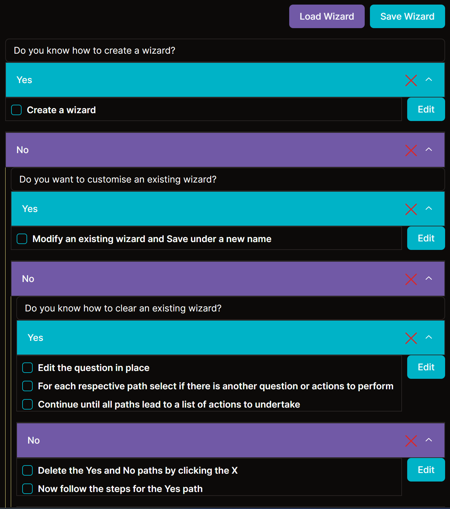

[Next.js](https://nextjs.org/) 14 project utilising the App Router and Server Actions.

Based on Jack Harrington's [Youtube video](https://www.youtube.com/watch?v=qCLV0Iaq9zU)

# Wizard Maker
Create Yes / No based wizards to guide users towards a checklist of actions to perform

## Technologies:
- React 18
- NextJS 14
- tRPC with ReactQuery
- Drizzle ORM with Postgres through [Neon](https://neon.tech) 
- TypeScript and Zod
- Tailwind
- Shadcn

## Deployed on Vercel
https://wizard-maker.vercel.app

### tPRC Server
**\servertrpc.ts** - initialise router and publicProcedure  
**\serverindex.ts** - create trpc appRouter instance that contains the db procedures

**\api\trpc\[trpc]\route.ts** - Connect trpc appRouter to the nextJS App Router _(need a route in the App Directory)_

Test: http://localhost:3000/api/trpc/getWizards

### React Query
Use ReactQuery to make the request from the client  
**\api\_trpc\client.ts** (dir starting with _ is ignored by the App Router routing) - tRPC React client (passing types - connects server types to client code)  
**\api\_trpc\Provider.tsx** - connect tRPC client to ReactQuery

### Drizzle ORM
**\db\schema.ts** - create schema for db tables  
**\drizzle.config.js** - connect the schema  
run `npm run generate` (drizzle-kit generate:pg) - to build the migration in **\drizzle**  

### Connect DB to tRPC
**\server\index.ts** - connect neon addapter to drizzle
